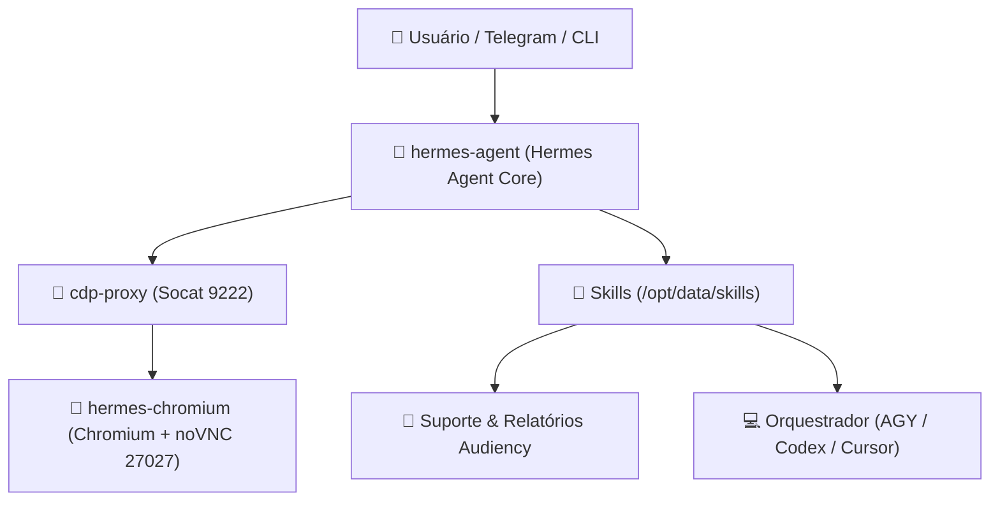

# 🤖 Hermes Agent Docker Setup

Setup completo do **Hermes Agent** em ambiente Docker com suporte a automação de navegador (Chromium headless + noVNC + CDP proxy), orquestrador de desenvolvimento de software em squad e skills especializadas.

---

## 🌟 Arquitetura dos Serviços

A composição (`compose.yaml`) é dividida em três serviços interdependentes:



1. **`hermes-agent`**: Núcleo do Hermes Agent baseado em `nousresearch/hermes-agent:latest`, configurado para rodar como gateway (Telegram/CLI) com suporte a Python, GitHub CLI (`gh`) e wrapper de harnesses de desenvolvimento.
2. **`hermes-chromium`**: Instância Chromium gerenciada (`linuxserver/chromium`) com display virtual e interface **noVNC** na porta `127.0.0.1:27027` (útil para login manual, 2FA e resolução de CAPTCHA).
3. **`cdp-proxy`**: Proxy TCP `socat` isolado que expõe o Chrome DevTools Protocol (`CDP`) internamente para o Hermes na rede Docker privada `172.30.0.0/24`.

---

## 📦 Skills e Personalizações Incluídas

### 🎯 Skills Customizadas (`/skills`)

- **`development-orchestrator`**:
  - Orquestra desenvolvimento de software abaixo de `/mnt/documentos`.
  - Permite escolher entre:
    - **Opção 1 (Squad de Desenvolvimento):** `AGY` (PO & PRD) ➔ `CODEX` (Implementação) ➔ `AGENT` (Cursor - QA & Code Review).
    - **Opção 2 (Desenvolvimento Direto):** Execução pontual com a ferramenta escolhida.
- **`suporte-audiency`**:
  - CLI autenticado para o painel de chamados do Suporte Audiency (`https://suporte.audiency.io`).
  - Lista, filtra, detalha, comenta, transfere squads e atualiza status de tickets.
- **`activity-report-audiency`**:
  - Gera relatório diário das alterações de chamados (criação, início, pausa, revisão, conclusão) por desenvolvedor com histórico em snapshot (`reports/audiency-activity-state.json`) e envio automático para o Rocket.Chat.

### 🧠 Configurações e Memórias (`/config`)

- **`config.yaml`**: Configuração central do modelo (OpenRouter / NVIDIA), guardrails de ferramentas, memória contextual e compressão de prompt.
- **`SOUL.md`**: Definição de personalidade e diretrizes operacionais do agente.
- **`memories/`**: Memória de longo prazo (`USER.md` e `MEMORY.md`) preservando preferências e fluxos operacionais.
- **`plugins/.install-metadata.json`**: Metadados de plugins integrados (`superpowers`, `cognee`, `drawio-skill`, `open-design`, `Anthropic-Cybersecurity-Skills`).

---

## 🛠️ Instalação do Docker (Caso ainda não tenha)

Se estiver configurando em uma máquina nova (Ubuntu/Debian):

```bash
# 1. Instalação rápida do Docker Engine e Docker Compose Plugin
curl -fsSL https://get.docker.com | sh

# 2. Adicionar seu usuário ao grupo docker (para rodar sem sudo)
sudo usermod -aG docker $USER
newgrp docker

# 3. Validar a instalação
docker --version
docker compose version
```

---

## 🚀 Como Subir o Projeto

### 1. Clonar o Repositório

```bash
git clone git@github.com:WallacyFrancis/hermes-agent-docker.git
cd hermes-agent-docker
```

### 2. Criar o Volume Persistente
O volume `hermes-agent-data` guarda a base de dados, memórias e cache do Hermes de forma independente:

```bash
docker volume create hermes-agent-data
```

### 3. Configurar Variáveis de Ambiente
Copie o template `.env.example` para `hermes.env` (ou `.env`) e preencha suas chaves e credenciais:

```bash
cp .env.example hermes.env
nano hermes.env  # ou abra no seu editor preferido
```

> **Atenção:** Mantenha suas credenciais seguras. O arquivo `hermes.env` e `.env` estão devidamente incluídos no `.gitignore`.

### 4. Construir e Iniciar os Containers

```bash
# Constrói a imagem customizada com as dependências e inicia os serviços em background
docker compose up -d --build
```

### 5. Verificar Status e Logs

```bash
# Ver status dos containers
docker compose ps

# Acompanhar os logs do Hermes em tempo real
docker compose logs -f hermes
```

---

## 🎮 Comandos Úteis do Ciclo de Vida

| Ação | Comando |
| :--- | :--- |
| **Iniciar containers** | `docker compose up -d` |
| **Parar containers** | `docker compose stop` |
| **Parar e remover containers** | `docker compose down` |
| **Reiniciar o Hermes** | `docker compose restart hermes` |
| **Reconstruir imagem após alterações** | `docker compose up -d --build` |
| **Ver logs de todos os serviços** | `docker compose logs -f` |

---

## 💬 Formas de Uso

### 📱 Via Telegram
Se a variável `TELEGRAM_BOT_TOKEN` estiver preenchida no arquivo de ambiente, o container iniciará automaticamente o gateway e responderá aos usuários autorizados em `TELEGRAM_ALLOWED_USERS`.

### 🖥️ Via Linha de Comando (CLI Interativo)
Você pode interagir diretamente com o agente no terminal usando:

```bash
docker compose exec -it hermes hermes chat
```

### 🌐 Acessando o Navegador noVNC (Chromium)
Para visualizar ou interagir manualmente com sessões de navegador abertas pelo agente:
- Abra no navegador do host: `http://127.0.0.1:27027`

---

## ⏰ Gerenciando Cronjobs / Agendamentos

O Hermes possui um agendador integrado para executar rotinas periódicas (por exemplo, envio diário de relatórios ou checagens).

### Criar uma tarefa agendada:
```bash
docker compose exec hermes hermes cron create \
  --schedule "0 9 * * 1-5" \
  --prompt "Gere e envie o relatório de atividades de desenvolvimento do dia anterior."
```

### Listar tarefas ativas:
```bash
docker compose exec hermes hermes cron list
```

Ou diretamente no chat do Telegram/CLI usando o comando `/cron`.

---

## 🔒 Segurança e Boas Práticas

- Todas as senhas e tokens são lidos exclusivamente das variáveis de ambiente (`/mnt/host/.env`).
- Redação automática de segredos ativa no Hermes para prevenir vazamento de credenciais em logs e prompts.
- Containers rodam com restrição de privilégios (`no-new-privileges:true`).
